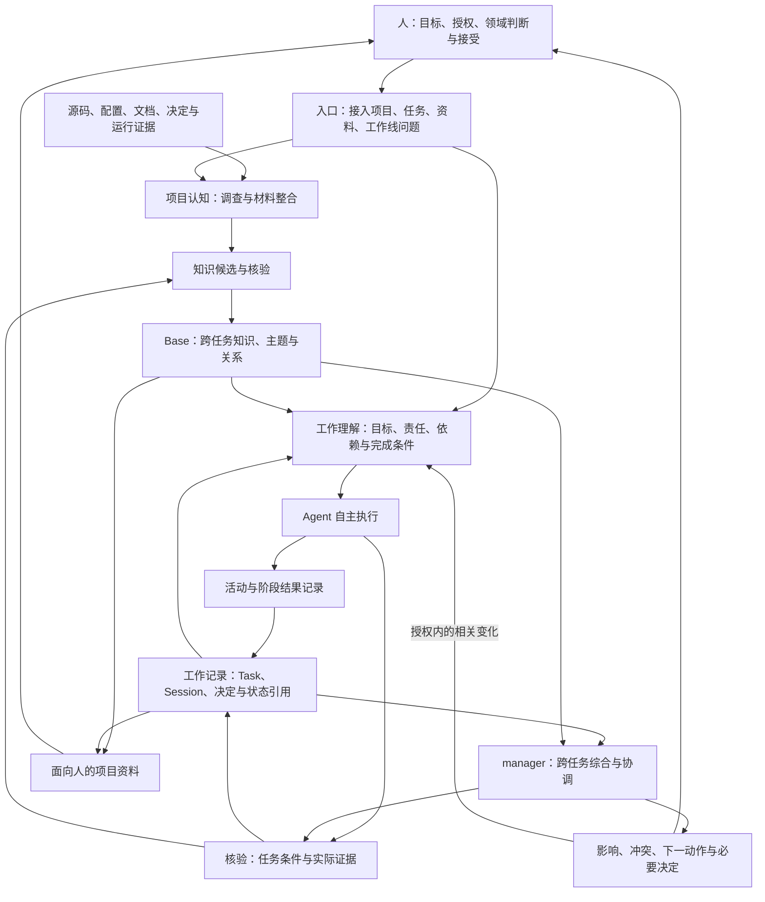

# 项目协作逻辑架构

状态：2026-09-22 设计提案；无产品运行、技术选型或多人效果声明。产品目标见[能力目标](../product/capability-goals.md)，协作语义由[协作契约](../contracts/project-collaboration-contract.md)维护。

## 1. 从使用者进入

用户提出任务、补充材料，或者询问一条工作线的状态。系统连接项目认识、当前工作、决定和证据，让 Agent 自主完成工作，并向用户展示结果、影响和需要判断的事项。

首次接入允许没有 Base；现有任务不强制先做全项目扫描。模型、宿主与工具可以变化，项目身份、语义和授权保持可追溯。

## 2. 逻辑结构

图表示责任和信息流，不规定服务、数据库或 Agent 数量。工作状态与长期知识有各自 owner；资料通过引用组合，不能产生另一套当前事实。

## 3. 五个 POV 如何工作

项目认知者处理 C1/C2；任务执行者主要处理 C3/C4；会话记录者形成 C5 的活动记录；manager 处理 C6 并把影响送回 C3/C4；结果核验者横跨模型、任务、综合和知识准入。

一次运行可以按需要切换 POV。记录者可以作为执行过程的检查点，manager 可以按请求生成一次综合，review 可以由同模型自查或独立核验承担。是否拆分由成本、权限、独立性和失败证据决定。

人类责任不是另一个可以由模型自动替代的 POV；共同目标、资源承诺和接受边界由明确授权约束。

## 4. 三类信息与唯一所有者

| 信息域 | 拥有内容 | 连接方式 |
| --- | --- | --- |
| 工程与原始证据 | 源码、配置、实际运行、原始决定/资料、授权范围内的会话来源 | 固定位置、revision、时间和环境引用 |
| 工作记录 | 目标、Task 状态、Session 活动、依赖、行动项、决定引用和核验结果 | 稳定身份、read basis、来源及状态变化 |
| Base | 跨任务有价值的事实、主题、关系、规则、经验和决定索引 | 已接纳 Delta、scope、来源与生命周期 |

长期主题与工程来源通过 Base 关联；当前任务进展从工作记录读取。一个已经完成任务的时间线可以归档，仍有效的经验由 Base 引用，原证据不因为压缩摘要而丢失。

manager 报告记录输入范围和时点，并指回上述 owner。保存的报告可以过期；它不能拥有独立的任务状态或规范。语义冲突回到对应 owner 处理，显示层不自行选择事实。

## 5. 六条能力如何连接

### 接入与整合

指定项目 → 确定可访问来源和覆盖 → Agent 理解结构与关键行为 → 核验模型与未知 → Delta 准入 → 初始 Base。附加资料进入同一路径，区分作者意图、设计提案、实现事实与观察证据。

### 工作与变化

请求 → Task Frame → 相关知识、当前决定和依赖 → Agent 执行。重要变化时重新取回相关上下文，形成阶段记录；原始事件由已有宿主或工具提供，语义由 Agent 判断。

每个 Task 保留它依据的目标、决定和来源版本。恢复及交付前核对相关变化；失效前提需要重新判断，不能仅更新时间戳。

### 交付与综合

产物 → 按条件核验 → Task 状态更新；Session 记录活动与交接，结束状态独立。manager 按工作线关系选取记录、核对依赖和决定，形成状态/演变/下一动作；长期部分形成 Delta。

### 后续使用

新的任务按用途、模块、依赖和问题语义取回知识与当前状态；维护者按问题打开资料。记录存在、知识被提供、被查阅、被采用和产生收益分别验证。

## 6. 必要的确定性边界

| 职责 | Agent 负责 | 工具在需要时负责 |
| --- | --- | --- |
| 相关性 | 判断主题、scope、因果与实际用途 | 检索、ID/引用解析、来源权限过滤 |
| 记录 | 提取活动、事实与候选，说明缺口 | 持久化、来源身份、去重与版本 |
| 并发 | 理解两项变化是否冲突 | 比较 read basis、阻止静默覆盖、保留历史 |
| 核验 | 判断条件和证据是否对应 | 执行测试、查询实际产物、检查引用完整性 |
| 事件 | 判断变化是否重要与可行动 | 宿主事件接入、触发状态、授权动作执行 |
| 展示 | 选择读者问题、解释和信息顺序 | 可重建视图、缓存失效与来源导航 |

共享存储可用文件、已有系统或服务；未选择事务/索引方案。工具对私人来源的访问控制不能仅依赖提示词。当前仓库只交付语义要求，没有实现这些工具责任。

## 7. manager 的执行边界

默认可综合、分析依赖、发现冲突和提出协调建议；已有授权覆盖的记录与工作动作可执行。新增跨人分派、共享优先级、外部消息或资源承诺必须有对应授权。

管理职责分布在参与者和系统之间，不引入必经的中央审批者。manager 不替 taskworker 指定每个调查步骤，也不把每个小任务升级成项目管理流程。相关变更应送达需要使用它的工作上下文；能否自动送达取决于真实适配能力。

## 8. 故障与所有权

| 失败 | 首先检查的责任 | 正确响应 |
| --- | --- | --- |
| 只有目录摘要，宣称全项目理解 | 项目认知与模型核验 | 补关系/流程证据，显示覆盖缺口 |
| 资料提案变成实现事实 | 材料整合与知识语义 | 修正状态和来源，不覆盖实现 owner |
| 新决定未影响旧任务 | 工作关联、事件/接续及执行者 | 核查是否可见、关联、提供与使用，更新受影响前提 |
| session 结束导致 task 被完成 | 工作状态与结果核验 | 回到任务条件判断，保留未完成项 |
| 同标签错误合并或跨模块漏联 | 相关性选择 | 按引用、scope、依赖和证据重判 |
| manager 把讨论写成已决定 | 记录与综合核验 | 回到具体确认来源 |
| 并发覆盖新决定 | 工作记录/Base 的版本边界 | 拒绝静默覆盖，重查受影响内容 |
| 本地测试被表述为整体业务成功 | 结果与工作线核验 | 收窄结论，暴露未验证条件 |
| 共享摘要泄露私人来源 | 授权与输出边界 | 排除受限内容，报告不含内容的覆盖限制 |
| 管理成本高于收益 | 产品交互与职责安排 | 缩减记录、角色或触发，重新比较 |

## 9. 实现选择与当前阶段

当前为 R1 协作设计重塑。首个切片先验证跨会话关系与状态，再以真实失败决定 Rule、Skill、Hook、MCP、记录工具和 UI；既有 agent-context-sync 与其他候选继续参与比较。

发布入口可研究插件或其他轻量形式，但方便传播与协作可靠分别验收。公开 Git 仓库只提供设计分发，不说明已有可安装产品。下一阶段见[MVP](../product/mvp-spec.md)，机制验收见[协作案例](../validation/collaboration-cases.md)。
