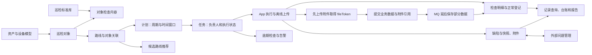

# 先看懂一件事：学校怎样安排一次设备检查

假设学校有几台水泵，每天需要检查有没有漏水、有没有异常声音。学校需要知道今天由谁去、是否已经检查、发现的问题是否处理。这是一个虚构场景，用来解释巡检项目处理的工作。

“巡检”就是按安排去查看设备情况，并记录结果。这个程序主要帮助人安排检查和保存记录。它不会代替人听水泵的声音，也不会仅靠这个接口自动判断设备正常不正常。

如果你只会数据库的增删改查，可以先跟着下面这次工作走一遍。每出现一种业务名称，都对应一份需要存下来的数据。

## 检查之前，要先录入什么

第一步，登记设备。例如设备编号 101，名称设备 01，放在 A 区 1 层 101 室。项目把这份设备登记资料叫“资产信息”。

第二步，把要定期检查的设备列出来。比如新增一条检查对象记录，自己的编号是 1，`capitalId` 填 101。这条记录表示“我们要检查的是设备 101”。代码把它叫“巡检对象”，类名是 `InspectObject`。编号 1 是检查对象的编号，101 是对应设备的编号。

第三步，给它配置要检查的内容。例如“是否漏水”“声音是否正常”。这些是检查表里的问题，不是检查结果。项目有一份可供选择的检查内容列表，再把需要的问题关联到具体对象。这两部分分别对应 `InspectContent` 和 `InspectObjectContent`。

到这里，系统知道了要检查哪台设备、它在哪里、检查时要回答什么。

## 把几台设备安排在同一次工作里

假设设备 01、02、05 都要由同一个人检查，可以把它们放进一个检查名单。项目把这种组织叫“路线”，存为 `InspectLine`；名单里有哪些对象，由 `InspectLineObject` 记录关联。

用简化表看，就是：

| 路线编号 | 名称 |
| --- | --- |
| 20 | 校园水泵检查 |

| 路线编号 | 包含的检查对象编号 |
| --- | --- |
| 20 | 1 |
| 20 | 2 |
| 20 | 5 |

这些是假设编号，用来解释关系。它和课程表中“一个课程关联多名学生”的存法类似：一行关联一项，不需要把所有设备信息重复存进路线记录。

如果还想帮检查人员选择先去哪一台，才会用到 `recommendLines`。这个方法取出选中的对象，返回排好顺序的几个列表。返回一个建议顺序和保存路线是两件操作；当前已读代码没有在推荐方法里自动保存新路线。

## “计划”和“任务”为什么要分开

“9 月 14 日到 16 日，每天上午检查这些设备一次”，是一个重复执行的安排，项目叫“计划”。

“9 月 14 日上午这一趟检查”，是一次具体的工作，项目叫“任务”。如果这个计划连续三天每天执行一次，就需要有三次任务，才能分别记录哪天完成、哪天没完成。

在当前代码中，保存计划的方法会根据周期和有效日期生成任务记录。计划用 `InspectPlan` 表示，任务用 `InspectTaskRecord` 表示。任务记录还能保存负责人和执行状态。因此不能只存一条“每天检查”的计划，然后不断覆盖同一个完成状态，否则就分不清每天的执行情况。

这些日期和次数只是讲解例子；具体有哪些周期、生成几次，需要由实际计划参数决定。

## 小林拿到任务以后，手机上记录什么

小林打开手机应用（App），查看今天的任务和设备检查内容，开始检查。完成设备 01 后，他对“是否漏水”填写了“是”，拍了一张照片；对其他设备填写相应结果。

保存结果时，仅写一句“有漏水”不够。程序还要知道是哪次任务、哪台设备、哪项检查内容：

| 哪次任务 | 哪个检查对象 | 回答哪个检查问题 | 填写的结果 |
| --- | --- | --- | --- |
| 今天上午这一趟 | 设备 01 | 是否漏水 | 是 |
| 今天上午这一趟 | 设备 01 | 声音是否正常 | 正常 |

这样的逐项结果，在代码里叫“检查明细”，用 `InspectRecordDetail` 表示。一次任务检查很多台设备，每台又有多个问题，所以一个任务可能产生很多行明细。

照片是单独的文件，也要记录它属于哪项结果。发现的漏水等异常，在项目里叫“缺陷”，后续可以记录处理情况。扫码记录则说明执行中发生过扫码操作；它和“是否漏水”的检查答案是不同的数据，不能混成同一张结果表来理解。

## 提交以后，别人怎样看到结果

检查期间，App 可以先保存一部分数据，之后再发送给服务端。服务端把任务、明细、照片关联和其他执行记录保存下来，后续才能查询某次检查的结果或生成报告。

用户提供的优化方案说明，原来照片上传和大量逐条保存会让提交等待很久。现在的处理方式包括：先把照片发到专门保存文件的程序，拿到文件编号或引用；再提交检查结果。部分结果交给后台继续保存，所以接口先返回时，某些明细可能还查不到。这里为什么会有时间差，在 [提交说明](submission-reassessment.md) 中从一次普通的保存请求讲起。

漏水问题还可以交给另一个问题处理系统跟进。对方把问题处理完后，这个巡检服务有接收状态回写的代码，可以更新本地记录。所谓“问题闭环”，就是从发现问题、交给人处理，一直到记录处理结果；不需要把它当成新的技术概念。

如果今天的任务超过要求时间还没有完成，还需要标记或提醒。项目里“逾期”就是这个意思。

## 对应到一次完整的数据变化

```text
录入设备和检查问题
  → 把几台设备放进一条路线
  → 设置何时重复检查的计划
  → 生成每一次要执行的任务
  → 人去检查，填写答案和拍照
  → 提交并保存任务结果
  → 查询报告，跟进发现的问题
```

你现在可以先读 [推荐顺序怎样计算](route-recommendation.md)，再读 [检查完以后怎样提交](submission-reassessment.md)。如果想了解作者改过哪些部分，再看 [wutea 的改动](wutea-history.md)。下面保留按文件定位的资料，需要改代码时再展开。

<details>
<summary>已经理解业务后，查对应的类、方法和实现限制</summary>

## 先认识业务里用到的数据

| 业务问题 | 数据对象和关系 | 对应代码 |
| --- | --- | --- |
| 检查什么设备/设施？ | `InspectObject` 关联 `kindId`、`capitalId`，携带项目/组织上下文；`capitalModel` 是翻译补齐的信息 | `InspectObjectServiceImpl` 管理巡检对象；资产数据来自翻译处理器，按配置选择资产服务或本地设备模型。[S07](evidence/source-catalog.md#s07)、[S09](evidence/source-catalog.md#s09)、[S41](evidence/source-catalog.md#s41) |
| 按什么内容检查？ | `InspectContent` 为标准库；`InspectObjectContent` 承载对象检查内容。后续结果以对象和内容关联 | 标准入口 `/api/inspect/standard`、对象内容模块。[S39](evidence/source-catalog.md#s39)、[S42](evidence/source-catalog.md#s42) |
| 一次工作包含哪些对象？ | `InspectLine` 与 `InspectLineObject` 组织路线和检查对象 | `InspectLineServiceImpl` 保存路线、查询对象树、复制和导出。[S19](evidence/source-catalog.md#s19)、[S40](evidence/source-catalog.md#s40) |
| 哪天、由谁完成？ | `InspectPlan` 描述周期；`InspectTaskRecord` 关联 `planId`、`lineId`，保存实际执行时间、负责人和状态 | 创建计划的主要逻辑实际在 `InspectLineServiceImpl.createPlan`；任务模块管理人工建任务与状态变化。[S20](evidence/source-catalog.md#s20)、[S28](evidence/source-catalog.md#s28)、[S38](evidence/source-catalog.md#s38) |
| 检查得到了什么？ | `InspectRecordDetail` 关联 task/object/content；`InspectNormal`、`DefectDetail`、`BugMain`、附件与扫码记录补充正常/异常和过程信息 | App 提交服务组织写入；部分表经 MQ 消费端保存，读写跨越异步边界。[S23–26](evidence/source-catalog.md#s23) |
| 问题如何闭环？ | 本地 `BugMain.defectId` 连接外部问题；`defectStatus`、`isFixed`、`bringDefect` 表达不同含义 | `syncDefectsStatus` 按外部问题 ID 查本地记录，完成/消缺映射为已解决，排除状态调整标志。[S34](evidence/source-catalog.md#s34) |
| 怎样查看一次检查？ | 任务/对象记录查询，按 `contentResultId` 取明细再组合对象与缺陷信息，报告和 Excel 台账 | 快照并非所有字段都来自冻结副本：会读当前对象和对象内容。[S35](evidence/source-catalog.md#s35)、[S36](evidence/source-catalog.md#s36)、[S32](evidence/source-catalog.md#s32) |

这些是应用层关系，不是已核验的数据库外键约束。对象名称、内容名称、快照历史一致性需要根据维护问题另查。

## 一条业务主线



图表示源码关系，不表示所有节点都发生在一个事务中，也不表示前端已将推荐结果自动保存为正式路线。推荐读取既有检查对象并输出排序；路线保存是另一个接口，二者在已读代码中没有直接自动落库调用。依据：[路线入口 S19](evidence/source-catalog.md#s19)、[计划生成 S20](evidence/source-catalog.md#s20)、[V2 同步 S23](evidence/source-catalog.md#s23)、[缺陷回写 S34](evidence/source-catalog.md#s34)。

## 三条关键流程

### 1. 计划怎样成为任务

管理入口在 `/api/inspect/line/create_plan`。`createPlan` 先保存计划，再按周期类型和生效窗口展开任务；单次计划直接生成一条任务。任务继承路线、项目与巡检类型等信息。周期任务的创建责任在计划提交方法，不能看到 `TaskJob` 就推断任务由定时器周期生成。[S19](evidence/source-catalog.md#s19)、[S20](evidence/source-catalog.md#s20)

关闭计划时，`clonePlanAndTask` 设置 `flagActive=false`，并将该计划 `startTime > 当前时间` 的任务标记删除。方法名含 `clone`，实际行为是停用。路线的 `updateLineActive` 只更新路线自身标志；两者影响不同，不应在资料中合并成“停用会统一取消所有任务”。[S21](evidence/source-catalog.md#s21)、[S06 所在文件](evidence/source-catalog.md#s06)

### 2. 巡检人员怎样接下并完成任务

App 有对象/任务详情查询、任务状态修改、是否可承接、委托、离线上传和轨迹入口。状态枚举仍包含 `OVERDUE(4)`，但当前逾期检查用独立 `overdue` 字段；读取状态不能只看旧枚举。[S22](evidence/source-catalog.md#s22)、[S29](evidence/source-catalog.md#s29)、[S30](evidence/source-catalog.md#s30)

`updateInspectTaskStatus` 会拒绝修改已结束任务；转为开始时在相应条件下复制上一轮缺陷快照并记录开始时间。负责人为空时用当前登录人补齐负责人和参与人，并清空候选人字段。代码的触发条件不宜简化成“必定只在点击开始时确定负责人”，需要结合调用和状态输入核对。[S28](evidence/source-catalog.md#s28)

`assignDelegation` 校验任务存在、未开始、不能委托给自己，更新负责人/参与人与候选字段，并保存委托记录；原委托人由当前登录人生成。事务注解属于这个委托方法，不能推广为整个巡检提交链具备单一事务。[S27](evidence/source-catalog.md#s27)

### 3. 离线上传怎样变成可查结果

第二轮补充的优化方案明确说明：先由 App 将附件独立上传到文件服务，拿到 fileToken 后再提交业务数据；目标是降低请求体积及弱网失败。这是文档报告的已完成改造，V2 后端存在引用保存路径，同时保留 Base64 兼容处理；未取得实际 App 请求或前后性能样本。[文档与实现对照](submission-reassessment.md)

`POST /api/inspectTaskApp/saveCacheInspectV2` 接收缓存 DTO，先在 Redis 暂存 5 天，执行已有同步判断，保存任务及相关照片，调用扫码和内容/缺陷保存，再对结束任务发送坐标保存消息，返回 taskId。[S23](evidence/source-catalog.md#s23)

当前正常登记、检查明细、部分附件、扫码记录和坐标保存走 MQ；队列消费者再写数据库并 ack，异常使用 nack，存在死信处理逻辑。消费者里定义了多种对象的处理器，不代表 V2 当前生产端都发送了对应消息：事实应以实际 `inspectMqSender.send` 调用为准。[S24](evidence/source-catalog.md#s24)、[S25](evidence/source-catalog.md#s25)、[S26](evidence/source-catalog.md#s26)

因此接口返回成功和所有关联结果已可查询是不同事件。这正是新方案希望通过异步化缩短等待时间的背景。文档还提出 Redis 补发、死信、幂等与有限重试；当前代码里能定位缓存、去重条件和死信，但完整补发/重试链及重复提交、进程重启、消息持久化、跨表一致性未经运行验证。报告导出或推荐历史若紧接上传执行，需要把这个时间边界纳入调查。

## 业务模块入口地图

| 模块 | 主要入口/类 | 阅读深度 |
| --- | --- | --- |
| 类型、标准、对象与设备 | `InspectTypeController`、`InspectContentController`、`InspectObjectController`、`InspectObjectContentController`、`InspectModelEquipmentController` | 接口与字段关系，资产翻译较深 |
| 路线、计划与推荐 | `InspectLineController`、`InspectPlanController`、`InspectLineRecommendController` | 计划创建、关闭与推荐调用链较深 |
| 任务、记录与 App | `InspectTaskRecordController`、`InspectTaskAppController`、`InspectRecordDetailController` | 状态、委托、V2 提交与对象快照较深 |
| 缺陷及类型 | `BugMainController`、`BugTypeController`、`DefectDetailController` | 缺陷状态同步较深，其余入口级 |
| 离线版本 | `AppVersionSyncController` | 下载、合并和预取入口级 |
| 统计、报表与语音 | `StatisticsController`、任务报告/Excel 方法、`SpeechController` | 入口级，未验证统计口径或语音供应商 |
| 框架和辅助 | `InspectLineObjectController`、`InspectScanCodeRecordController`、`BugTypePropertyController`、`DefectProDetailController` 等 | 已枚举；类名和重复 Swagger 标签不作为完整能力证据 |

全部 21 个 Controller 的注解与行号见 [机器清单](evidence/controller-inventory.json)。还枚举了 `web/rest` 框架资源、client、job、config 等区域；业务图未把日志管理等框架资源当成独立巡检流程。

## 运行与外部边界

这是单个 Gradle 服务工程，应用入口 `MicroSafeCheckServiceApp`。源码构建声明 Java 8、Spring Boot `2.0.8.RELEASE`、Gradle wrapper `5.6.2`；业务层主要使用 MyBatis-Plus，构建也保留 JPA/Hibernate/Liquibase 与多种数据库驱动。依赖声明不证明对应数据库均在当前部署启用。[S02](evidence/source-catalog.md#s02)、[S03](evidence/source-catalog.md#s03)、[S44](evidence/source-catalog.md#s44)、[S45](evidence/source-catalog.md#s45)

| 边界 | 服务需要它提供什么 | 本次已知与未知 |
| --- | --- | --- |
| 资产/设备 | 对象模型、坐标及空间扩展字段 | `CapitalTranslateHandler` 和 `CapitalClient` 已核对；`project.equipment` 影响来源，外部返回数据未取样 |
| 用户/组织与登录上下文 | 人员、负责人、项目和组织范围 | 委托和资产翻译读取当前用户；没有做权限隔离审计 |
| 数据库 | 主体业务数据和历史查询 | 映射/SQL 可读；目标部署引擎、版本、默认值、执行计划未核验 |
| Redis / RabbitMQ | 缓存、异步结果保存和告警设置 | 存在调用和消费者；真实投递、重启和可恢复性未验证 |
| 外部问题服务 | 缺陷流转与状态回写 | 回写方法已读；外部完整状态机未覆盖 |
| 文件、消息和基础工程服务 | 附件下载、报告存储、逾期通知、工程信息 | Feign 客户端已枚举，未做跨服务联调 |

README 是 JHipster 生成说明，仍强调 Registry；当前构建中 Eureka starter 被注释，加入了 Nacos discovery/config 依赖。这是需要复核的文档陈旧信号，不能按 README 直接断言当前运行必须连接旧 Registry。[S01](evidence/source-catalog.md#s01)、[S02](evidence/source-catalog.md#s02)

README 记录的历史入口包括 `gradlew.bat`、`gradlew.bat test` 和 `gradlew.bat -Pprod clean bootWar`。本次没有执行它们。恢复可运行环境需要先确认 profile、数据库及外部服务；不要把文档中的启动命令等同于已验证的启动方案。

## 下一次修改先取哪些资料

改推荐：先看 [推荐的输入、依赖和限制](route-recommendation.md)。改离线上传：先看异步可见性与 [批量/逐条/MQ 演变](wutea-history.md)。改逾期：一起看 `runStatus`、`overdue`、任务列表过滤与 `TaskJob`。改停用：分别检查路线标志、计划标志和已生成任务。改快照或报表：先确定读取的是历史值还是当前对象值，以及记录是否仍在等待 MQ 保存。

本文依据源码 revision `8af0fc2d4c6ab064efbcc0154a543ba08eb98b3e` 整理。文中的管理、巡检和问题处理角色是按接口用途作出的解释，具体岗位分工尚待业务方确认。

[返回案例](analysis.md) · [wutea 的改动](wutea-history.md) · [路线推荐](route-recommendation.md)

</details>
