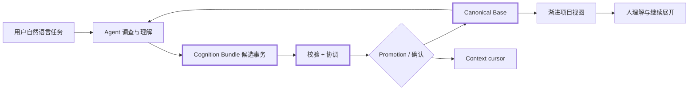
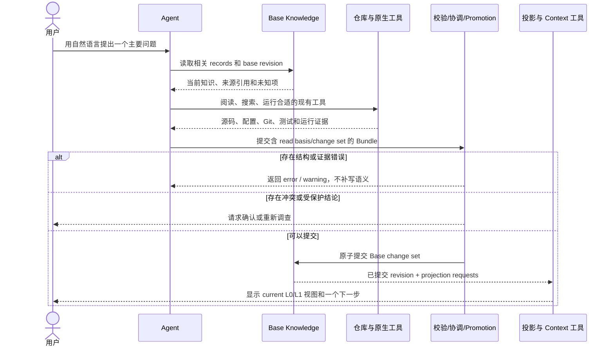
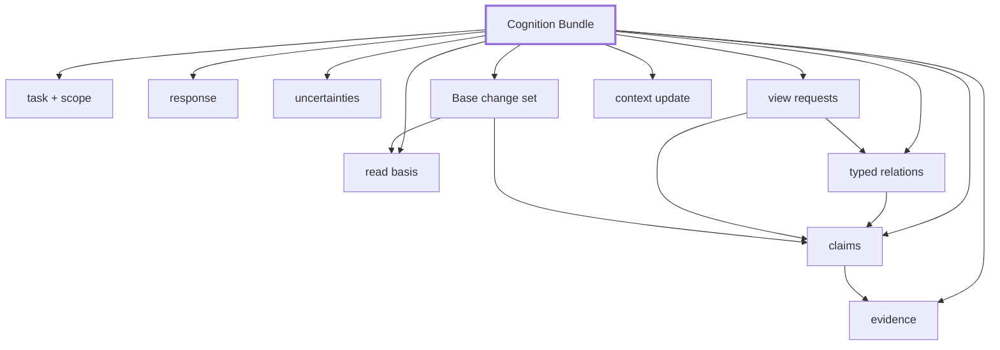

# Project Cognition Progressive Output Walkthrough

Status: Historical design fixture 0.2; superseded as product mainline  
Scenario: First-time maintainer orientation  
Last updated: 2026-09-03

> This fixture preserves the earlier L0–L3 experiment. It is not the current product workflow or active output contract. The current direction starts from a real Agent task, governs direction/policy/outcome, extracts a small Knowledge Delta, and only then generates the human material needed for a reader question. See `docs/product/mvp-spec.md` and `docs/contracts/visual-view-contract.md`.

## 1. Why This Fixture

本样例使用 Project Cognition 自身作为第一份输出内容与表现形式测试，目的是先验证协议和注意力路径，不引入某种编程语言、框架或扫描方式的适配噪声。

这是 Agent 提出的工作假设，尚未替代外部真实仓库 Golden Case，也不表示下面的字段和版式已经冻结。

## 2. Input Intent

```yaml
task:
  question: Project Cognition 当前要解决什么问题，它怎样工作？
  intent: orient-maintainer
  audience: first-time-maintainer
  requested_depth: L0

scope:
  repository: project-cognition
  revision: working-tree

read_basis:
  base_id: project-cognition
  base_revision: fixture-not-created

primary_sources:
  - ../product/mvp-spec.md
  - ../architecture/information-system-architecture.md
  - ../contracts/base-knowledge-contract.md
  - ../contracts/agent-output-contract.md
  - ../contracts/visual-view-contract.md
  - ../../.agent-context/decisions/DEC-2026-09-02-001-agent-led-analysis-and-progressive-visuals.md
  - ../../.agent-context/decisions/DEC-2026-09-03-001-canonical-base-and-derived-projections.md
```

设计要求：首屏只回答一个问题，用户无需先理解 Claim Schema、状态枚举、MCP、Hook 或内部文件结构。

## 3. L0 — Project Landmark

### Question

Project Cognition 当前要解决什么问题，它怎样工作？

### Direct Answer

Project Cognition 让 Agent 把对任意技术栈项目的调查结果交付成有来源和状态的候选事务，经通用工具校验、协调后维护到唯一 Base Knowledge，再从 Base 单向生成可逐层理解和验证的项目视图。

### Primary Visual



### What to Notice

- Agent 负责适应仓库，而不是项目维护一个通用扫描器。
- Cognition Bundle 是 Agent 与工具之间的稳定边界，但只代表一次任务候选。
- Base Knowledge 是长期资料的唯一规范登记处；README、图和 handoff 都不能另存一份当前真相。
- 工具负责校验、协调、记录和投影，但不能替用户确认业务或架构结论。

### Important Unknown

Base 的物理格式、状态枚举、promotion policy 和首版渲染组合仍处于 T1C 草案阶段；本例还不是实际 Base snapshot。

### Dominant Next Action

[跟随一次从自然语言到输出的完整流程](#4-l1--critical-flow)。

## 4. L1 — Critical Flow

### Question

一次项目理解任务如何从用户问题变成可阅读输出？

### Direct Answer

Agent 先读取与任务相关的 Base revision，再自主取证并提交结构化 Bundle；工具在校验和协调后只提交允许 promotion 的变更，current 视图只从提交后的 Base 生成。

### Primary Visual



### What to Notice

- 调查过程可以因语言和仓库而不同，交付格式保持稳定。
- Pipeline 可以拒绝错误结构，不能替 Agent 发明来源或用旧 revision 覆盖新值。
- 任务回答可以立即返回；只有满足 promotion 条件的部分进入 Base。
- 输出只展开当前问题需要的内容，并声明所依据的 Base revision。

### Important Unknown

哪些低风险 derived fact 允许自动 promotion、哪些每次需要人工确认，尚需用真实案例收紧。

### Dominant Next Action

[展开 Cognition Bundle 的内容组成](#5-l2--cognition-bundle-focus)。

## 5. L2 — Cognition Bundle Focus

### Question

一次任务输出怎样与长期 Base 分开？

### Direct Answer

最小 Bundle 需要说明读了哪个 Base revision，并把即时回答、证据候选、Base change set、视图请求和 context update 分开；只有 change set 经过协调和 promotion 后才改变长期知识。

### Primary Visual



### What to Notice

- Response 直接服务当前用户，可以只在当前任务存在。
- Claim 和 relation 都要能回到 evidence 或明确标为 inferred。
- Change set 必须相对 read basis 表达，不能把整个 Bundle 当成 Base snapshot 覆盖写入。
- View request 与 context update 是消费意图，不是新的项目事实。

### Important Unknown

Base record、Bundle 和 projection manifest 的精确 schema 与文件布局尚未决定。

### Dominant Next Action

[查看这些结论的状态和证据边界](#6-l3--evidence-detail)。

## 6. L3 — Evidence Detail

### Question

上面最重要的结论凭什么成立？

| Claim | Kind / Status | Evidence | What It Does Not Prove |
|---|---|---|---|
| 用户以自然语言沟通 | declared intent / human-confirmed | [accepted decision](../../.agent-context/decisions/DEC-2026-09-02-001-agent-led-analysis-and-progressive-visuals.md) | 不证明所有输入都无需澄清 |
| Agent 负责适应仓库技术栈 | declared intent / human-confirmed | [accepted decision](../../.agent-context/decisions/DEC-2026-09-02-001-agent-led-analysis-and-progressive-visuals.md) | 不证明 Agent 的每次推断都正确 |
| 不建设通用扫描器 | declared intent / human-confirmed | [MVP spec](../product/mvp-spec.md) 与 accepted decision | 不排除未来增加有证据支持的可选适配器 |
| 工具消费结构化 bundle | declared intent / human-confirmed direction | [Agent output contract](../contracts/agent-output-contract.md) | 不表示 bundle 字段已经冻结 |
| 长期项目知识只维护一个 Canonical Base | declared intent / human-confirmed direction | [canonical Base decision](../../.agent-context/decisions/DEC-2026-09-03-001-canonical-base-and-derived-projections.md) | 不表示 Base 的物理格式已经冻结 |
| README、图和模块卡是单向投影 | declared intent / human-confirmed direction | [projection ownership contract](../contracts/projection-ownership-contract.md) | 不表示所有旧文档已经迁移或能自动生成 |
| 首版可采用 Markdown + Mermaid | proposed | [visual view contract](../contracts/visual-view-contract.md) | 不表示已经完成渲染验证或用户选择 |

### Dominant Next Action

回到 L0，并评审首屏内容是否足以建立正确心智模型；不要继续增加字段，除非一个真实问题无法表达。

## 7. Presentation Recommendation to Test

首个表现形式建议采用：

```text
Markdown 外壳
  + 一句直接答案
  + 一张 Mermaid 主图
  + 3-5 个注意点
  + 1 个重要未知
  + 1 个下一步链接
  + 独立证据详情
```

这是待验证建议，不是最终决定。

### Why Start Here

- Markdown 便于 Git 审阅、链接来源和保留文字 fallback；
- Mermaid 便于快速验证图的内容和关系语义；
- 多个静态页面用稳定链接即可先验证渐进展开，不必提前开发交互式 Viewer；
- SVG 可以作为后续渲染产物加入，而不改变 view specification。

## 8. Review Checklist

- L0 是否在不解释内部 schema 的情况下说明了项目目的？
- L0 是否只有一个主要下一步？
- L1 是否呈现了一条完整且单一的主流程？
- L2 字段组是否过多，是否有可以合并或延迟的内容？
- L3 是否清楚区分了“证据支持什么”和“证据不能证明什么”？
- Mermaid 未渲染时，标题、直接答案和注意点是否仍足以理解？
- 用户是否必须阅读所有层级才能获得第一层价值？如果是，则设计失败。

## 9. Questions This Fixture Should Resolve

1. `read_basis`、`response`、`claims`、`evidence`、`relations`、`uncertainties`、`view_requests`、`change_set` 和 `context_update` 是否构成合适的首批内容组？
2. L0 → L1 → L2 → L3 是否是自然的理解顺序？
3. Markdown + Mermaid + 稳定链接是否足以作为 MVP 表现基线？
4. 哪些内容在默认视图中仍然过重，应该推迟到证据层？
5. 用户能否清楚区分“任务回答”“待 promotion 的候选”和“已提交 Base 当前知识”？
