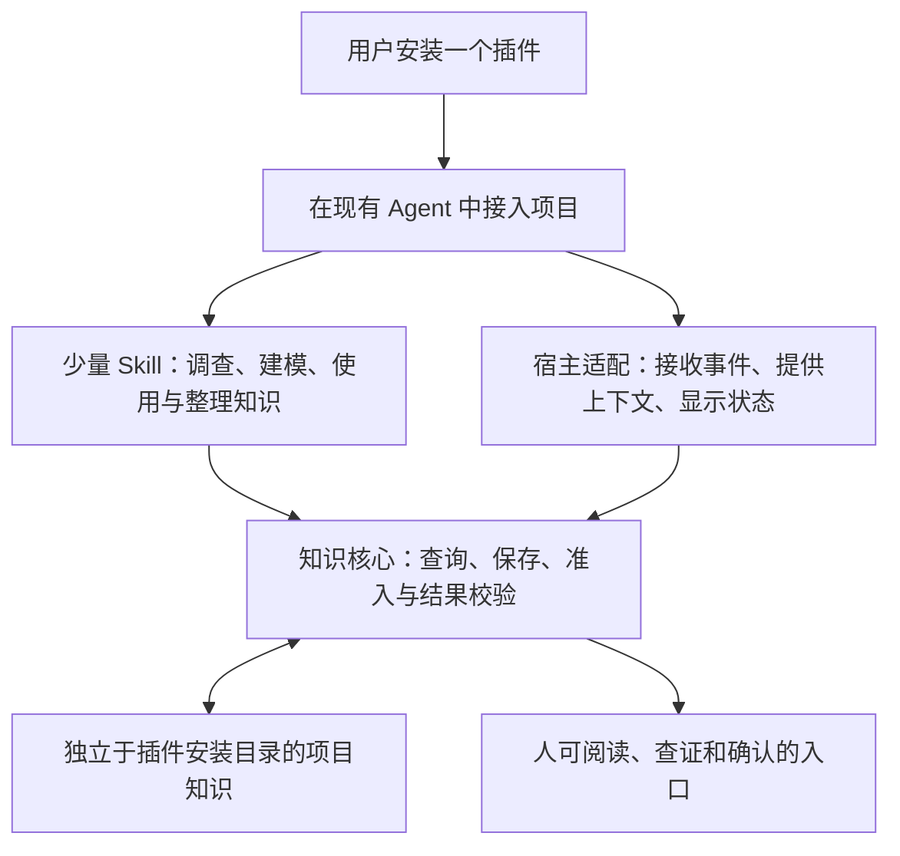

# 从现有插件看传播方式与执行保障

> 2026-09-22 状态说明：本文保留原核对时点的研究结论。当前产品已扩展到项目协作，新的取舍见[项目管理研究](project-collaboration-foundations.md)。旧候选尚未针对跨用户、工作线、权限和并发重新验证，不能由原覆盖推定新目标已满足；本仓库现已公开，本文此前“无发布仓库”的描述属于历史时点。

核对日期：2026-09-07。当前只整理资料与设计；未安装、启用或运行本文样本。用户已明确要求产品方便传播，并提出参考 Superpowers 与轻量插件。下文的产品形态和验收细化属于 proposed。

## 1. 对当前产品的建议

优先考虑把 Project Cognition 做成一个可安装的插件产品：用户从一个入口获取，内部组合少量 Skill、宿主适配与必要的运行代码。知识核心是逻辑职责，可以随包提供并按需执行；常驻服务、独立窗口和额外账户是否必要，需要另有证据。

功能覆盖、安装负担、日常操作负担与运行成本分别评价。插件打包可以帮助传播，自动触发和规则落实仍要追踪到实际执行机制。该方向沿用[薄治理主线](../../.agent-context/decisions/DEC-2026-09-03-003-thin-governance-and-companion-knowledge.md)，具体保障边界见[候选记录](../../.agent-context/decisions/DEC-2026-09-07-004-product-form-and-execution-guarantees.md)。

## 2. 样本与选择依据

选择流程型 Superpowers、工具型 Context7 和命令型 commit-commands，比较同样称为插件时的不同承载方式。前两者具有较广的公开关注度；第三个是 Anthropic 官方目录和文档直接介绍的轻量例子。GitHub 仓库星数只用于选样，不代表插件安装量、留存或效果。

| 样本 | 固定 revision | 本次观察的仓库星数 | 检查范围 |
| --- | --- | ---: | --- |
| obra/superpowers | `b36e0829c6d0140e93cfef2ca599b1b07d4a7797` | 282,722 | README、Codex/Claude 清单、启动 Hook、Windows 启动包装、入口 Skill |
| upstash/context7 | `80e681a507c5287bc12e483367c40754e29461b9` | 61,732 | Codex 插件 README、市场清单、插件清单、MCP 配置、文档查询 Skill |
| anthropics/claude-plugins-official 中的 commit-commands | `85cce0381e7860082641b59d961a2b8c368b8b79` | 36,002（整个官方目录） | 插件目录、清单、README 与 commit 命令；结合宿主官方安装文档 |

已保存 18 个文件及上游许可证，见[来源清单与 SHA-256](../../output/plugin-distribution-research-20260907/sources.json)。这些文件是研究快照，未作为活动 Skill 或插件加载，也未执行其中的指令或脚本。

## 3. 实际组织方式与可借鉴部分

### Superpowers：一个插件分发多项开发方法

README 提供各宿主的安装入口，包括 Codex 和 Claude Code 的插件市场。仓库通过多宿主清单共享 Skill 目录；Codex 清单还提供名称、用途、示例提示和品牌资料。它说明功能较多的产品仍可由一个插件入口交付。[README](https://github.com/obra/superpowers/blob/b36e0829c6d0140e93cfef2ca599b1b07d4a7797/README.md)、[Codex 清单](https://github.com/obra/superpowers/blob/b36e0829c6d0140e93cfef2ca599b1b07d4a7797/.codex-plugin/plugin.json)

自动进入流程的方式需要按宿主区分。通用 `hooks/hooks.json` 在会话启动等时机调用脚本，脚本把 `using-superpowers` 的入口说明送入上下文；后续方法使用仍由 Agent 根据说明选择。当前 Codex 清单显式为 `hooks: {}`，不能把仓库里存在通用 Hook 推导成该 Codex 包也配置了它。宿主官方文档说明，清单显式定义 hooks 时会替代默认 hooks 文件路径。[启动配置](https://github.com/obra/superpowers/blob/b36e0829c6d0140e93cfef2ca599b1b07d4a7797/hooks/hooks.json)、[启动脚本](https://github.com/obra/superpowers/blob/b36e0829c6d0140e93cfef2ca599b1b07d4a7797/hooks/session-start)、[Codex Hook 规则](https://learn.chatgpt.com/docs/hooks)

Windows 启动包装寻找可用 Bash，找不到时会成功退出而不注入启动内容。这是本次静态源码观察，未验证用户环境；对我们意味着“安装成功”和“自动能力可用”必须分开呈现。[Windows 包装](https://github.com/obra/superpowers/blob/b36e0829c6d0140e93cfef2ca599b1b07d4a7797/hooks/run-hook.cmd)

**拟借鉴：** 一个产品入口、多宿主适配、共享方法目录、清楚的用途与示例、对启动与上下文收缩的专门处理。Project Cognition 的薄治理目标继续决定哪些流程值得加入；Superpowers 的完整开发方法不因打包方便而自动成为本项目规范。

### Context7：很薄的插件连接工具服务

Codex 插件只需清单、一个文档查询 Skill 和 MCP 配置；市场索引指向相应插件目录。Skill 引导 Agent 先定位库，再查询具体文档；MCP 连接托管服务。README 说明安装后的 OAuth 登录与新任务加载要求。[插件说明](https://github.com/upstash/context7/blob/80e681a507c5287bc12e483367c40754e29461b9/plugins/codex/context7/README.md)、[插件清单](https://github.com/upstash/context7/blob/80e681a507c5287bc12e483367c40754e29461b9/plugins/codex/context7/.codex-plugin/plugin.json)、[查询 Skill](https://github.com/upstash/context7/blob/80e681a507c5287bc12e483367c40754e29461b9/plugins/codex/context7/skills/context7-mcp/SKILL.md)

**拟借鉴：** 用户只装一个能力入口，方法和工具在内部协作；工具结果按问题提供。此例的插件很薄，整体能力仍依赖后端、网络和认证。Project Cognition 是否需要托管服务不能由这个例子直接推出，Skill 的自动匹配也不能作为固定时机查询已执行的证据。

### commit-commands：用少量动作提供明确用途

该目录主要是插件清单、说明和三个命令文件。`commit.md` 为一次提交收集 Git 上下文并给出任务指令；没有本目录自己的记忆服务或生命周期 Hook。官方安装文档通过插件市场、安装范围和带命名空间的命令说明其使用方式。[插件目录](https://github.com/anthropics/claude-plugins-official/tree/85cce0381e7860082641b59d961a2b8c368b8b79/plugins/commit-commands)、[commit 定义](https://github.com/anthropics/claude-plugins-official/blob/85cce0381e7860082641b59d961a2b8c368b8b79/plugins/commit-commands/commands/commit.md)、[宿主安装与管理](https://code.claude.com/docs/en/discover-plugins)

它的 README 对自动可用和短命令名的表述较简略；当前宿主文档明确区分安装、激活与命名空间。接入说明应以实际宿主和版本核对，不能只照搬插件 README。

**拟借鉴：** 入口少、用途具体、调用后有明确结果。首次建模、查看项目知识和检查接入状态适合有直接入口；开发中使用经验的目标还需要自动时机支持。此样本不构成长期记忆与自动捕获的完整替代方案。

## 4. 对 Project Cognition 的候选产品形态

一个插件作为统一分发单元，按宿主提供适配清单，共享产品能力与项目知识语义。

图表示逻辑关系，未冻结进程、语言、存储、命令名称或窗口形态。知识核心可以按需运行，Agent 继续负责语义调查、相关性判断和研发工作；程序负责已确定的触发、记录和可机器检查的状态条件。

建议首个支持范围围绕当前使用环境选择，优先核验 Codex 与 Windows；跨宿主扩展复用同一能力核心，各自声明触发和工具覆盖。即使两个宿主安装同名插件，也应分别验证所承诺的自动行为。

传播入口可以先采用公开仓库与宿主支持的市场索引；获得官方市场收录属于后续分发工作。当前没有发布仓库、申请收录或承诺可安装版本。[Codex 插件分发](https://learn.chatgpt.com/docs/plugins)、[Claude Code 市场机制](https://code.claude.com/docs/en/discover-plugins)

## 5. 方便传播应有的验收设计

用户已确认“方便传播”；以下是将这一要求变为可检查结果的 proposed 细化：

| 用户要做的事 | 拟定完成条件 |
| --- | --- |
| 判断值不值得安装 | 一个入口说明帮助谁、解决什么、首次得到什么；能看见所需权限、环境和成本 |
| 安装并开始使用 | 使用宿主标准安装流程；必要依赖、信任或认证步骤集中呈现；能区分已安装、已启用和自动能力可用 |
| 在自己的项目中看到价值 | 用普通语言发起首次建模，得到可用模型、来源和未知；说明尚未覆盖范围 |
| 日常继续开发 | 相关知识按需提供，重要发现及时形成候选；不要求背诵组件名或反复整理整套文件 |
| 与已有工具一起使用 | 保持现有 Agent 工作入口，避免与 agent-context-sync 或开发方法插件重复注入、重复记录及争夺流程 |
| 更新或停用 | 插件版本与项目知识分开维护；更新不覆盖知识，停用停止相关自动行为，卸载后知识仍可导出和接续 |
| 介绍给另一个人 | 对方可按同一说明在其支持环境独立安装和首次使用，无需作者现场代配置；默认分享产品包不携带私人项目内容 |
| 判断长期代价 | 单独记录安装时间、手动步骤、首次结果等待、普通任务的额外上下文/运行成本、打断次数及升级维护成本 |

常驻服务、数据库、独立账户和额外窗口会增加安装与维护责任，应由实际能力缺口证明必要性。应用内即使需要这些实现，用户也应通过一个连贯入口完成必要操作。

## 6. 仍需解决的保障问题

插件包装统一了交付，实际保障继续分层：程序可检查查询和记录是否执行、产品内状态是否满足准入条件；Agent 是否理解并正确运用知识要用任务证据和评审验证；目标、规范和风险等决定保持既有人工授权边界。

任何宿主不支持的触发点、未启用的 Hook、不可用的服务或无法覆盖的工具路径，都应明确表现为未覆盖或故障。不能因为界面显示已安装就显示这些能力已保障。

后续设计先形成各能力的触发、责任、证据、故障行为及成本表。收到新的实施指令后，再验证安装、首次建模、开发中隐藏能力发现、中途捕获、更新与停用。当前只有源码和资料核对，没有产品优越性或可安装性实测。
