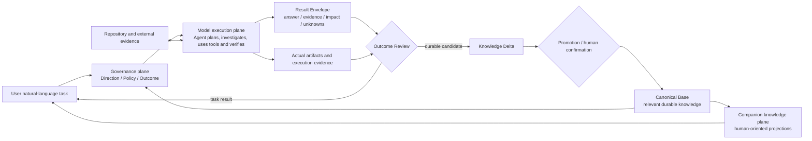

# Project Cognition Information System Architecture

Status: Revised logical architecture; effectiveness unverified  
Phase: R1 capability boundary  
Last updated: 2026-09-05  
Related decisions: `.agent-context/decisions/DEC-2026-09-03-003-thin-governance-and-companion-knowledge.md`, `.agent-context/decisions/DEC-2026-09-05-001-staged-validation-and-evidence-review.md`

## 1. Architecture Outcome

Project Cognition 在强模型外部维护方向、规范、结果要求和长期知识，使维护者能够核对 Agent 的工作，并利用累积知识继续判断项目变化。当前架构为以下目标提供职责边界，其实际效果由分阶段验证建立：

- 指向正确目标；
- 获得相关项目约束；
- 交付可判断的结果；
- 把可复用认知与临时回答分开；
- 从同一长期知识生成对人类友好的资料。

## 2. Architectural Invariants

1. **Model-led execution** — Agent 自主决定调查、工具、推理、验证和表达方式。
2. **Direction before procedure** — 系统明确要解决的问题，Agent 选择适合项目的工作步骤。
3. **Outcome before orchestration** — 先判断结果是否合格，再决定是否需要额外编排。
4. **Evidence scales with claim risk** — 证据要求随结论风险提高，不给所有任务施加最高成本。
5. **One canonical durable model** — 跨任务知识只有一个 Canonical Base。
6. **Promotion is explicit** — 任务结果不会因为流畅或正确就整体进入 Base。
7. **Authority remains typed** — 代码、测试、运行证据和人类决定证明不同的事情。
8. **Human material is derived** — 人类资料从 Base 派生，不成为第二个当前事实系统。
9. **Provider neutrality** — 核心契约以项目语义表达，适用于不同模型、语言、上下文大小和工具协议。
10. **Mechanisms follow observed failures** — 固定流程和基础设施对应已经观察到的重复失败。

## 3. Three Logical Planes



### Governance Plane

保存和选择：

- 当前任务方向和完成条件；
- 与任务相关的项目规范；
- 结果最低要求；
- 必须由人确认的边界。

它可以由文档、Agent 提示、规则或未来工具实现，具体形态由纵向验证选择。

### Model Execution Plane

由 Coding Agent 和其可用模型承担：

- 理解仓库和上下文；
- 选择搜索、Git、构建、编译、测试、语言服务、浏览器或其他工具；
- 决定调查范围和深度；
- 形成假设并获取证据；
- 自我验证、画图和组织结果。

Project Cognition 通过方向、规范和结果契约支持这一层，让模型能力直接参与项目工作。

### Companion Knowledge Plane

把已晋升的 Base 知识按人的问题组织为：

- 项目入口和应用框架；
- 运行、数据或事件流程；
- 模块职责和内部机制；
- 局部关系视图；
- 连续技术说明；
- 证据、历史和未知项入口。

它使用已确认知识设计阅读体验；新的项目事实继续由真实任务和证据产生。

## 4. End-to-end Flow

### 4.1 Frame

```text
原始自然语言请求
→ 提取目标、scope、适用边界和完成条件
→ 选择相关规范、决定、Base 事实和未知项
→ 形成可供用户核对的 Task Frame
```

Task Frame 是由自然语言生成的轻量语义结构。模型参与生成，原始意图同时保留供用户核对。

### 4.2 Execute

```text
Task Frame + selected context
→ Agent 自主计划
→ 仓库和工具调查
→ 适合风险等级的验证
→ Result Envelope
```

不同强模型可以使用各自擅长的方法；评审统一关注目标、规范和结果。

### 4.3 Review

```text
Result Envelope
→ 目标是否回答
→ 规范是否遵守
→ 证据是否支撑结论强度
→ 影响和未知是否暴露
→ 哪些问题必须交回人类
```

Review 接收结果及其引用的实际产物和证据。核验者按重要完成条件查看源码、diff、测试、运行或决定记录，给出判定及理由；[结果契约](../contracts/agent-output-contract.md#7-outcome-review) 统一状态语义。自查、证据核验和人工接受分别记录，最终业务和架构接受仍属于人。

执行环境或任务记录保存必要的动作与结果，已有日志可通过引用复用。只有核验关键行为、规范遵守或失败原因所需的部分进入 Review；内部推理不属于记录要求。首版可以人工连接证据，不预设独立的追踪平台。

### 4.4 Promote

```text
任务结果
→ 提取跨任务有价值的 Knowledge Delta
→ 与 Base 比较：新增 / 修正 / 重复 / 冲突 / 失效
→ 必要的人类确认
→ 新 Base revision
```

长期记录聚焦足以支撑项目知识的来源、状态和决定。

### 4.5 Project

```text
人的问题 + reader baseline + Base subset
→ Agent 选择合适资料形式和解释顺序
→ 生成文章 / 图 / 模块说明 / 关系视图
→ 读者从结论回到 Base 身份和证据
```

表现形式可以随模型和工具进步而变化，知识身份与来源不变。

## 5. Minimal Logical Components

| Capability | Responsibility | May Be Performed By | Success Condition |
|---|---|---|---|
| Task Framing | 保持目标、范围和完成条件 | Agent + human review | 用户能核对 Agent 对任务的理解 |
| Context Selection | 选择相关规范和 Base 内容 | Agent, retrieval or simple rules | 上下文达到最小充分 |
| Agent Runtime | 自主完成项目工作 | Existing coding agent/model | 模型充分使用仓库与工具能力 |
| Outcome Review | 按完成条件核验实际产物与证据，暴露影响和未知 | Human, model reviewer, deterministic checks | 判定有来源，核验范围和接受状态清楚 |
| Delta Extraction | 分离长期知识候选 | Agent | Delta 只保留跨任务价值 |
| Promotion | 处理来源、冲突、确认和生命周期 | Policy + human + optional tools | Base 更新可追溯且符合权威边界 |
| Base | 维护可复用项目认知 | Git files or future storage | 后续任务能取得稳定上下文 |
| Projection | 生成面向人的资料 | Agent + replaceable renderer | 读者能借助资料完成具体判断并回到证据；实际使用另行观察 |
| Context Adapter | 保持当前任务连续性 | `.agent-context` or host feature | 新 Session 能快速恢复当前动作 |

这些是职责边界。首版可以由协议和人工验证共同承担，验证后再决定合并或实现哪些组件。

## 6. Minimal Information Objects

### Task Frame

回答：这次要做什么、哪些约束相关、什么结果算完成。

### Result Envelope

回答：完成了什么、凭什么、影响什么、还不知道什么；每项重要完成条件由谁核验、依据什么、结果如何。

### Knowledge Delta

回答：本次工作产生了哪些值得跨任务保留的新增、修正、冲突或失效知识。

### Base Record

回答：一个长期项目事实、意图、决定、风险、关系或未知项目前是什么状态，以及依据是什么。

### Human Projection

回答：特定读者为了一个问题，应怎样低负担地理解相关 Base 内容。

精确字段和序列化格式仍未冻结。

## 7. Authority Boundary

| Question | Primary Authority | Required Complement |
|---|---|---|
| 当前 revision 中代码如何实现 | source/build/config | 业务原因由 decision 提供 |
| 某测试或运行发生了什么 | bound execution evidence | 长期策略和验收由人确认 |
| 为什么采用某设计 | human-confirmed decision | 实现证据说明完成状态 |
| Agent 对跨文件关系的解释 | sourced inference | 高影响关系追加验证或确认 |
| 当前任务是什么 | user request and handoff | 长期事实由 Base 提供 |
| 当前人类资料显示什么 | Base + projection input | 关键结论链接回 Base 与来源 |

## 8. Evidence Policy

不为所有任务要求完整覆盖证明：

- 局部、可直接验证的结论：提供相关文件、符号、测试或行为证据；
- 结构性设计结论：说明主要影响范围、关键关系和未验证部分；
- “全项目不存在”类结论：必须说明实际调查范围、使用方法和盲区；
- 运行时、硬件或外部系统结论：使用绑定环境和 revision 的实际观察；
- 用户验收、架构选择和风险接受：必须由人确认。

## 9. Base Focus

Base 只保存：

- 跨任务仍有价值的事实与关系；
- 人类声明的目标和规范；
- 已确认决定及其引用；
- 重要风险、冲突和未知项；
- 支撑上述内容的来源与适用范围。

任务回答留在当前工作记录，原始工程内容留在仓库和证据系统，交互状态留在用户会话；Base 使用引用连接这些来源并保存跨任务语义。

## 10. Projection Boundary

- 一个投影只回答一个读者问题；
- 资料形式由内容和阅读任务决定，不由固定文档分类决定；
- 投影可以按需生成、缓存或删除；
- 关键事实可以回到 Base 身份、scope 和来源；
- 人工修改中的新语义先形成 Knowledge Delta，再进入 Base；
- 文章和图随新的 Base revision 重新生成。

## 11. Failure Model

| Failure | Owner | Required Response |
|---|---|---|
| Agent 误解目标 | Task Framing | 显示差异并修正方向 |
| Agent 遗漏项目约束 | Context Selection / Policy | 补充相关规范，重做结果检查 |
| 声称完成但产物或证据未核验 | Outcome Review | 标记受影响条件尚未验证，打开来源核验后重新判断 |
| 证据支持范围小于结论 | Outcome Review | 降低结论强度或追加验证 |
| 人工与模型判定不一致 | Outcome Review | 对照具体条件和来源定位分歧，校准后再扩大自动化范围 |
| 强模型已能处理但流程仍强制编排 | Architecture | 删除不必要过程约束 |
| 临时回答污染 Base | Promotion | 拒绝或缩小 Delta |
| 多个资料维护不同事实 | Projection ownership | 回到 Base，废止并行维护 |
| Base 与源码可能漂移 | Agent investigation | 标记待复核，不由时间戳猜测语义 |
| 资料难读 | Projection | 改变解释和视图，不改造事实来源 |

## 12. Implementation Selection

纵向 Golden Run 将为以下选择提供证据：

- 本地库、CLI、MCP、Hook、Skill 或插件承担哪些职责；
- 文件、事件日志、数据库或 Git 对象如何保存 Base；
- 单模型、多模型 reviewer 和人工 Review 如何组合；
- Markdown、HTML、图形运行时或 IDE 如何承载人类资料。

当某项职责需要确定性执行、外部持久化或自动触发时，选择对应的最小实现形态。

## 13. Current Phase

### R1 — Current

- 修订 Task Frame、Result Envelope、Knowledge Delta 的最小语义及其验证边界；
- 补实首例任务、证据判据和后续复用案例；
- 确认首例要支持的真实变化和人类决定，保留任务候选状态直到确认。

### R2 — Next

- 对固定项目执行一次由强模型自主规划的 Golden Run；
- 核验重要完成条件，记录真实失败、人工补充和修正成本，为基础设施选择提供依据。

### Later

- 从真实失败中决定最小 Rule、Skill、Hook、MCP、validator、recorder 或 renderer；
- 使用同一次工作产生的 Base Delta 验证资料和真实读者判断，再在后续任务验证知识复用；
- 通过独立运行和必要的条件可比对照，逐步建立稳定性及成本收益证据；
- 再决定物理存储和产品界面。

## 14. Architecture Acceptance Checklist

- 模型变强后，能否删除提示而不修改核心语义？
- Agent 能否用新的工具和方法完成同一任务而不改协议？
- 一个结果是否可以被判断为“回答错了问题”，即使代码和格式都很好？
- 一个结果是否可以被判断为“违反规范”，即使局部实现能够运行？
- 高风险结论是否有与强度匹配的证据和盲区说明？
- 任务回答能否完成而没有任何内容进入 Base？
- Base 是否只保存跨任务有价值的认知？
- 人类资料能否从 Base 重建而不独立维护事实？
- 删除所有历史 fixture 后，核心目标是否仍然完整成立？
- 每项必要完成条件能否回到实际产物及核验记录，而不仅是执行者自述？
- 一次成功、后续知识复用、真实读者反馈和对照收益是否保持各自证据范围？
