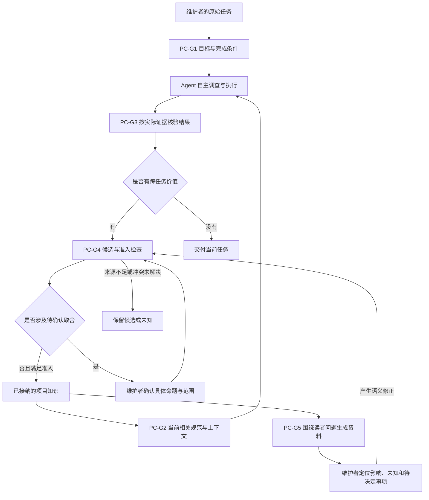

# 一次工作中的能力关系

Base 读取基点：`pc-base-20260907-01`，记录 PC-G1–PC-G5、PC-V1。  
来源入口：[已确认知识索引](../../knowledge/base.md)。图表达已确认的职责关系，运行效果见对应任务证据。

你从一个实际任务开始。Agent 获得当前相关的目标与规范，自主调查和执行；交付会回到完成条件接受核验。有后续价值的发现进入知识候选，满足来源、范围和确认条件后供后续任务与人类资料使用。

图中的确认只针对确实需要人判断的命题，既有授权仍然有效。图不要求每次任务经过所有节点；一次普通修改可以在结果核验后结束。

当你想知道“这项改动会影响什么”，从 PC-G5 的资料进入相应知识 ID，再返回支持它的源码、决定或运行证据。语义需要修正时回到候选与准入环节；表达和导航问题可以直接改进资料。

这份流程与 [能力目标说明](../product/capability-goals.md) 使用相同知识基点。它们是否帮助你完成维护判断，按 PC-V1 记录真实使用反馈；生成这两份文件只证明资料产出。
