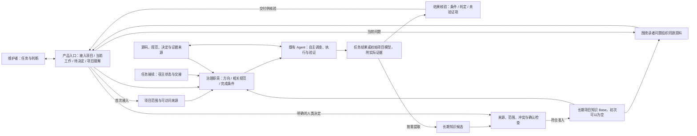

# Project Cognition Information System Architecture

Status: Logical architecture proposal; no implementation selected or effectiveness established  
Phase: R1 materials, direction and architecture review  
Last updated: 2026-09-07  
Related decisions: `.agent-context/decisions/DEC-2026-09-03-003-thin-governance-and-companion-knowledge.md`, `.agent-context/decisions/DEC-2026-09-05-001-staged-validation-and-evidence-review.md`, `.agent-context/decisions/DEC-2026-09-07-001-design-first-and-context-sync-baseline.md`

## 1. Architecture Outcome

Project Cognition 在强模型外部维护方向、规范、结果要求和长期知识，使维护者能够核对 Agent 的工作，并利用累积知识继续判断项目变化。当前架构为以下目标提供职责边界，其实际效果由分阶段验证建立：

- 指向正确目标；
- 获得相关项目约束；
- 交付可判断的结果；
- 把可复用认知与临时回答分开；
- 从同一长期知识生成对人类友好的资料。

这些职责同时服务首次全项目建模和后续持续工作。首次接入以可访问项目来源为起点建立模型，Base 可以为空；维护阶段使用该模型并按变化核实与更新。

新应用还必须保留 `agent-context-sync` 的连续性与确认边界，并让上述工作更省心。完整能力目标和比较门槛由 [产品能力目标](../product/capability-goals.md) 定义。本架构解释为达成目标需要哪些责任；具体分层和交互是设计提案，效果仍需真实使用证明。

### 从维护者的操作进入架构

产品入口需要围绕以下问题连续提供信息：

| 用户当前的问题 | 优先呈现 | 主要动作 |
| --- | --- | --- |
| 第一次接入，这个项目是什么 | 项目范围、调查进展、初始结构与流程、来源和未知 | 接入项目、查看模型或补充必要意图 |
| 这次在做什么 | 当前目标、适用约束、进展与重要偏差 | 提出任务、纠正理解或继续工作 |
| 现在需要我判断什么 | 完成条件与证据、待决定命题、相关影响 | 核验交付、明确取舍、要求补证或修正 |
| 我需要理解项目的哪一部分 | 与问题相关的行为、关系、决定、未知和来源 | 展开细节、返回证据或提出后续任务 |

这些是信息职责，可以在一个连续入口中完成。用户无需先选择某个 Skill 或知识文件。独立窗口、IDE 内集成或宿主内入口仍是待比较的承载形式，当前没有界面实现方案。

## 2. Architectural Invariants

1. **Model-led execution** — Agent 自主决定调查、工具、推理、验证和表达方式。
2. **Direction before procedure** — 系统明确要解决的问题，Agent 选择适合项目的工作步骤。
3. **Outcome before orchestration** — 先判断结果是否合格，再决定是否需要额外编排。
4. **Evidence scales with claim risk** — 证据要求随结论风险提高，不给所有任务施加最高成本。
5. **One canonical durable model** — 跨任务知识只有一个 Canonical Base。
6. **Promotion is explicit** — 任务结果不会因为流畅或正确就整体进入 Base。
7. **Authority remains typed** — 代码、测试、运行证据和人类决定证明不同的事情。
8. **Human material is derived** — 人类资料从 Base 派生，不成为第二个当前事实系统。
9. **Provider neutrality** — 核心契约以项目语义表达，适用于不同模型、语言、上下文大小和工具协议。
10. **Mechanisms follow observed failures** — 固定流程和基础设施对应已经观察到的重复失败。
11. **Completeness and usability are both required** — 扩展能力时保留基线价值，实际收益包括使用与维护成本。
12. **Continuity and durable knowledge have distinct owners** — 当前任务游标与长期项目知识分工明确，使用引用连接。

## 3. Three Logical Planes



### Governance Plane

保存和选择：

- 当前任务方向和完成条件；
- 与任务相关的项目规范；
- 结果最低要求；
- 必须由人确认的边界。

它把当前任务理解与规范使用情况交给产品入口呈现。已有规则和 Skill 可以承载其中的可复用方法；需要稳定记录或确定性检查的部分再由工具承担。具体形态由后续比较选择。

### Model Execution Plane

由 Coding Agent 和其可用模型承担：

- 理解仓库和上下文；
- 选择搜索、Git、构建、编译、测试、语言服务、浏览器或其他工具；
- 决定调查范围和深度；
- 形成假设并获取证据；
- 自我验证、画图和组织结果。

Project Cognition 通过方向、规范和结果契约支持这一层，让模型能力直接参与项目工作。

### Companion Knowledge Plane

把已晋升的 Base 知识按人的问题组织为：

- 项目入口和应用框架；
- 运行、数据或事件流程；
- 模块职责和内部机制；
- 局部关系视图；
- 连续技术说明；
- 证据、历史和未知项入口。

它使用按准入规则接纳的知识设计阅读体验，保留其中的推断与未知状态；需要人确认的目标、规范和取舍须有对应确认。新的项目事实继续由真实任务和证据产生。

### 产品入口与接续

产品入口将三个平面的结果组织成用户当前能够行动的信息。接续记录保存本次目标、未完成项、待决定事项和相关引用；Base 保存跨任务知识。`agent-context-sync` 可作为接续适配的参考或候选，具体是否保留原文件协议仍待验证。

恢复任务时先检查当前请求和最近状态，再选择有关长期知识与来源。恢复记录与源码不符时暴露差异并查证；文件存在或时间较新都不自动代表其内容适用。

没有可用模型时，产品支持直接发起首次全项目建模。接入来源来自用户指定项目，已有仓库资料仍可利用；不将缺少交接文件视为无法开始，也不要求用户先给一个局部改动来积累知识。

## 4. End-to-end Flow

### 4.0 Initialize

```text
已有项目 → 指定范围与来源快照 → Agent 全项目调查 → 初始模型、覆盖与未知
从零项目 → 用户目标与已有资料 → 目标、约束与设计模型 → 待决定项
两种起点 → 结果核验与知识准入 → 初始 Base → 人类入口与后续任务
```

初次接入的独立责任包括识别项目来源、保持全项目范围、组织调查进展和初始模型。语义调查由同一个 Agent 执行层承担，并复用已有 Review、Promotion、Base 与 Projection，具体输入和产物见 [PC-G0](../product/capability-goals.md#首次接入的两种起点)。

Agent 先建立可核对的项目范围，再自主选择阅读、解析、检索、构建或其他仓库工具，连接主要模块、接口、配置、状态和端到端行为。来源清单与覆盖记录区分仅发现、已调查、待理解和受限区域；分批完成时保留整体剩余范围，恢复后复核来源变化。

初始模型必须表达关键实体、关系、来源和状态。直接观察与跨来源推断分别呈现，缺少业务原因或运行证据时保留未知。模型报告不因扫描结束而自动成为已确认知识；可定位事实按项目已授权政策登记，受保护意图与取舍集中交给人判断。

首次知识增量可以比日常更新更大，调查明细留在任务证据，Base 保留有后续价值的项目语义。从零模型中的拟议结构保持 proposed，用户接受目标或设计不等于已有实现。后续任务通过来源与影响变化修正同一模型，不默认重新扫描全项目。

“薄治理”约束的是职责与实现方式。独立的全项目建模功能与 Agent 自主调查共存，不要求建设一套通用跨语言解析器。

### 4.1 Frame

```text
原始自然语言请求
→ 提取目标、scope、适用边界和完成条件
→ 选择相关规范、决定、Base 事实和未知项
→ 形成可供用户核对的 Task Frame
```

Task Frame 是由自然语言生成的轻量语义结构。模型参与生成，原始意图同时保留供用户核对。

重要解释、scope 或完成条件变化必须在产品入口可见。可调查的事实由 Agent 查证；只有缺失的人类意图、受保护取舍或授权影响继续工作时，才形成相应人类决定点。

### 4.2 Execute

```text
Task Frame + selected context
→ Agent 自主计划
→ 仓库和工具调查
→ 适合风险等级的验证
→ Result Envelope
```

不同强模型可以使用各自擅长的方法；评审统一关注目标、规范和结果。

### 4.3 Review

```text
Result Envelope
→ 目标是否回答
→ 规范是否遵守
→ 证据是否支撑结论强度
→ 影响和未知是否暴露
→ 哪些问题必须交回人类
```

Review 接收结果及其引用的实际产物和证据。核验者按重要完成条件查看源码、diff、测试、运行或决定记录，给出判定及理由；[结果契约](../contracts/agent-output-contract.md#7-outcome-review) 统一状态语义。自查、证据核验和人工接受分别记录，最终业务和架构接受仍属于人。

执行环境或任务记录保存必要的动作与结果，已有日志可通过引用复用。只有核验关键行为、规范遵守或失败原因所需的部分进入 Review；内部推理不属于记录要求。首版可以人工连接证据，不预设独立的追踪平台。

### 4.4 Promote

```text
任务结果
→ 提取跨任务有价值的 Knowledge Delta
→ 与 Base 比较：新增 / 修正 / 重复 / 冲突 / 失效
→ 必要的人类确认
→ 新 Base revision
```

长期记录聚焦足以支撑项目知识的来源、状态和决定。

当前任务交付与知识准入分别推进。没有知识增量可以直接完成任务；有价值但来源不足的候选可以保留待查状态。普通已授权记录沿既有政策处理，目标、规范、架构取舍和风险接受的确认绑定具体命题与范围。

### 4.5 Project

```text
人的问题 + reader baseline + Base subset
→ Agent 选择合适资料形式和解释顺序
→ 生成文章 / 图 / 模块说明 / 关系视图
→ 读者从结论回到 Base 身份和证据
```

表现形式可以随模型和工具进步而变化，知识身份与来源不变。

## 5. Minimal Logical Components

| 对应目标 | 逻辑职责 | 输入 → 输出 | 责任边界 |
| --- | --- | --- | --- |
| PC-G0 | Project Initialization / Model Assembly | 项目来源或目标资料 → 全项目调查范围、初始模型、证据关系与未完成项 | 产品保持范围与可接续状态，Agent 识别和理解，复用 Review 与准入 |
| 日常使用与接续 | 产品入口 / Context Adapter | 请求、任务状态、决定与知识引用 → 当前工作和主要下一动作 | 呈现和恢复状态；原始任务与长期事实各有归属 |
| PC-G1 | Task Framing | 原请求、相关决定 → 目标、scope、完成条件和重要解释 | Agent 提取，用户掌握意图和取舍 |
| PC-G2 | Context Selection | 当前任务、规范、Base 与源码 → 相关来源、适用边界和未知 | Agent 判断相关性；工具可提供检索和引用检查 |
| 六项能力的执行基础 | Agent Runtime | 任务与上下文 → 调查、实际产物和验证证据 | 复用既有 Coding Agent 的执行能力 |
| PC-G3 | Outcome Review | 完成条件、产物、证据 → 逐项判定与未验证项 | 模型做语义评审，工具核验确定性事实，人工接受另有状态 |
| PC-G4 | Delta / Promotion | 候选、来源、scope、冲突和人类决定 → 接纳、修正、待查或拒绝 | Agent 理解语义；政策规定准入；人掌握受保护决定 |
| PC-G4 | Base / Evidence References | 接纳的知识与来源引用 → 可追溯、可复核的长期知识 | 保留语义身份和生命周期；源码与执行日志留在原 owner |
| PC-G5 | Human Projection | 读者问题、Base 子集 → 说明、关系和来源导航 | 与 Agent 使用同一知识；真实理解效果另行观察 |

这是责任划分，不规定服务数量。先复用既有 Agent、项目来源和合适工具，后续按实际缺口决定组件合并或实现。候选与具体版本集中在 [资料索引](../research/capability-baseline-and-candidates.md#3-哪些现成材料可供各项职责使用)，当前没有采用结论；首次初始化目录与真正建立项目模型要分别核对。

## 6. Minimal Information Objects

### Task Frame

回答：这次要做什么、哪些约束相关、什么结果算完成。

### Initial Project Model

回答：这个项目如何组成和工作、重要约束与关系是什么、哪些已知有依据、哪些仍未理解。它是首次任务结果的一种语义组织，长期部分通过同一 Knowledge Delta 进入 Base；不建立第二个权威知识库，也不预定独立 schema。

### Result Envelope

回答：完成了什么、凭什么、影响什么、还不知道什么；每项重要完成条件由谁核验、依据什么、结果如何。

### Knowledge Delta

回答：本次工作产生了哪些值得跨任务保留的新增、修正、冲突或失效知识。

### Base Record

回答：一个长期项目事实、意图、决定、风险、关系或未知项目前是什么状态，以及依据是什么。

### Human Projection

回答：特定读者为了一个问题，应怎样低负担地理解相关 Base 内容。

精确字段和序列化格式仍未冻结。

状态至少保持以下区别：任务有产物、完成条件已经核验、人类已经接受、知识已经准入、资料已经生成、真实读者已经使用。这些状态不能因其中一项变化而整体升级。当前 `knowledge/base.md` 只是设计期来源索引示例，其文件名和草稿编号不冻结 Base 的物理实现。

## 7. Authority Boundary

| Question | Primary Authority | Required Complement |
|---|---|---|
| 当前 revision 中代码如何实现 | source/build/config | 业务原因由 decision 提供 |
| 某测试或运行发生了什么 | bound execution evidence | 长期策略和验收由人确认 |
| 为什么采用某设计 | human-confirmed decision | 实现证据说明完成状态 |
| Agent 对跨文件关系的解释 | sourced inference | 高影响关系追加验证或确认 |
| 当前任务是什么 | user request and handoff | 长期事实由 Base 提供 |
| 当前人类资料显示什么 | Base + projection input | 关键结论链接回 Base 与来源 |

## 8. Evidence Policy

不为所有任务要求完整覆盖证明：

- 局部、可直接验证的结论：提供相关文件、符号、测试或行为证据；
- 结构性设计结论：说明主要影响范围、关键关系和未验证部分；
- “全项目不存在”类结论：必须说明实际调查范围、使用方法和盲区；
- 运行时、硬件或外部系统结论：使用绑定环境和 revision 的实际观察；
- 用户验收、架构选择和风险接受：必须由人确认。

## 9. Base Focus

Base 只保存：

- 跨任务仍有价值的事实与关系；
- 人类声明的目标和规范；
- 已确认决定及其引用；
- 重要风险、冲突和未知项；
- 支撑上述内容的来源与适用范围。

任务回答留在当前工作记录，原始工程内容留在仓库和证据系统，交互状态留在用户会话；Base 使用引用连接这些来源并保存跨任务语义。

来源或依赖变化时，先识别受影响知识，再复核其语义与适用范围。工具可以发现引用失效、文件或 revision 变化；Agent 判断这是否改变事实或解释。旧记录保留历史关系，需要人判断的冲突交给明确决定点。自动发现变化的方式、执行时机和存储索引都仍是实现候选。

## 10. Projection Boundary

- 一个投影只回答一个读者问题；
- 资料形式由内容和阅读任务决定，不由固定文档分类决定；
- 投影可以按需生成、缓存或删除；
- 关键事实可以回到 Base 身份、scope 和来源；
- 人工修改中的新语义先形成 Knowledge Delta，再进入 Base；
- 文章和图随新的 Base revision 重新生成。

## 11. Failure Model

| Failure | Owner | Required Response |
|---|---|---|
| 无旧记忆就无法建模，或只生成目录摘要 | Project Initialization / Outcome Review | 从项目来源开始，核验结构与关系模型，补足首次接入完成条件 |
| 局部调查被描述为全项目完成 | Project Initialization / Outcome Review | 对照指定范围与实际覆盖，标明缺口、接续调查和部分完成状态 |
| Agent 误解目标 | Task Framing | 显示差异并修正方向 |
| Agent 遗漏项目约束 | Context Selection / Policy | 补充相关规范，重做结果检查 |
| 声称完成但产物或证据未核验 | Outcome Review | 标记受影响条件尚未验证，打开来源核验后重新判断 |
| 证据支持范围小于结论 | Outcome Review | 降低结论强度或追加验证 |
| 人工与模型判定不一致 | Outcome Review | 对照具体条件和来源定位分歧，校准后再扩大自动化范围 |
| 强模型已能处理但流程仍强制编排 | Architecture | 删除不必要过程约束 |
| 临时回答污染 Base | Promotion | 拒绝或缩小 Delta |
| 多个资料维护不同事实 | Projection ownership | 回到 Base，废止并行维护 |
| Base 与源码可能漂移 | Agent investigation | 标记待复核，不由时间戳猜测语义 |
| 资料难读 | Projection | 改变解释和视图，不改造事实来源 |
| 用户重复填表、确认或管理文件 | Product interaction / Policy | 定位负担来源，沿用已有授权，缩减非必要步骤并重新比较 |
| 接续或旧知识误用造成退步 | Context Adapter / Base | 保留失败证据，修正责任划分与适用性检查，未解决前不宣称可替代基线 |

## 12. Implementation Selection

先审阅目标、基线和逻辑架构；得到新的实施指令后，真实任务比较再为以下选择提供证据：

- 本地库、CLI、MCP、Hook、Skill 或插件承担哪些职责；
- 文件、事件日志、数据库或 Git 对象如何保存 Base；
- 单模型、多模型 reviewer 和人工 Review 如何组合；
- Markdown、HTML、图形运行时或 IDE 如何承载人类资料。

当某项职责需要确定性执行、外部持久化或自动触发时，选择对应的最小实现形态。

Skill 适合表达可复用任务方法；Hook 适合触发已确认的检查点；MCP 或其他适配负责连接现有服务；存储与校验工具负责记录和引用完整性；界面负责当前焦点、判断和导航。语义理解、适用性判断和解释仍由 Agent 承担。任何候选均需说明目标覆盖、实际缺口、新增成本和替换方式。

现成方案如果已经覆盖某组责任，可以整体复用。资料中出现的缺省目录、固定阶段或写作偏好需要适配审阅，不能自动变成产品目标。早期 `skills/project-cognition/` 保留为未采纳草稿，当前不接入、不运行。

## 13. Current Phase

### R1 — Current

- 整理已确认目标、现有基线和候选资料；
- 审阅从能力目标推导的责任、用户操作和信息归属；
- 设计相对 `agent-context-sync` 更完善、更好用的比较方式；
- 保留 Task Frame、Result Envelope、Knowledge Delta 的语义设计与 Golden Case 候选；当前不实施或试运行。

### R2 — Next

- 收到新的实施指令后，先固定实际任务、基线配置、完成条件和成本观察方式；
- 对固定项目执行一次由强模型自主规划的 Golden Run；
- 核验重要完成条件，记录真实失败、人工补充和修正成本，为基础设施选择提供依据。

### Later

- 从真实失败中决定最小 Rule、Skill、Hook、MCP、validator、recorder 或 renderer；
- 使用同一次工作产生的 Base Delta 验证资料和真实读者判断，再在后续任务验证知识复用；
- 通过独立运行和必要的条件可比对照，逐步建立稳定性及成本收益证据；
- 再决定物理存储和产品界面。

## 14. Architecture Acceptance Checklist

- 模型变强后，能否删除提示而不修改核心语义？
- Agent 能否用新的工具和方法完成同一任务而不改协议？
- 一个结果是否可以被判断为“回答错了问题”，即使代码和格式都很好？
- 一个结果是否可以被判断为“违反规范”，即使局部实现能够运行？
- 高风险结论是否有与强度匹配的证据和盲区说明？
- 任务回答能否完成而没有任何内容进入 Base？
- Base 是否只保存跨任务有价值的认知？
- 人类资料能否从 Base 重建而不独立维护事实？
- 删除所有历史 fixture 后，核心目标是否仍然完整成立？
- 每项必要完成条件能否回到实际产物及核验记录，而不仅是执行者自述？
- 一次成功、后续知识复用、真实读者反馈和对照收益是否保持各自证据范围？
- 没有 Base 或旧会话时能否直接建立初始模型，且关键关系有来源、整体覆盖可核对？
- 从零项目的目标与设计是否与已实现事实保持独立状态？
- 用户能否按当前工作、待决定事项和项目问题操作，而无需管理组件与文件？
- 新能力是否保留基线的可靠接续、确认和隐私边界，日常负担是否实际改善？
- 来源变化后，工具发现的变化与 Agent 对语义失效的判断是否分开？
