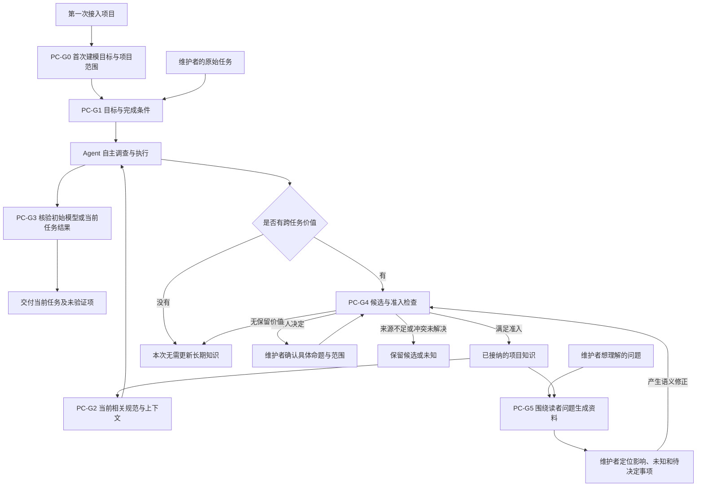

# 一次工作中的能力关系

状态：概念流程示意，2026-09-07；未实施、未经过真实使用验证。  
目标来源：[能力目标及其确认来源](../product/capability-goals.md#7-来源与文档分工)。图用于审阅职责配合，不代表已运行的产品或已确定的组件。

首次使用时，可以直接接入已有项目，让 Agent 全项目调查并建立初始模型；从零项目则从目标与设计开始。已有模型后，可以围绕普通项目任务继续工作。两种入口都核验结果与来源，适合长期使用的知识进入同一个 Base。

图中的确认只针对确实需要人判断的命题，既有授权仍然有效。交付和知识准入分别推进；本次任务可以完成，而知识仍保持候选状态。普通修改不要求额外生成资料。

初次建模时 Base 可以为空，调查范围来自指定项目。模型需要覆盖主要结构和行为，并保留来源、关系和未知；分批结果显示实际覆盖，不能把局部完成描述为整个项目已建模。后续任务只复核相关变化，使用同一个长期模型继续积累。

当你想知道“这项改动会影响什么”，可以从 PC-G5 的资料展开相关知识，再返回支持它的源码、决定或运行证据。用户无需先记住知识 ID。语义需要修正时回到候选与准入环节；表达和导航问题可以直接改进资料。

新应用必须在保留 `agent-context-sync` 接续能力的基础上，让这条路径更完善、更好用。需要通过后续任务与真实读者使用比较，生成这张图只证明设计材料产出。更完整的职责与来源归属见 [逻辑架构](../architecture/information-system-architecture.md)。
